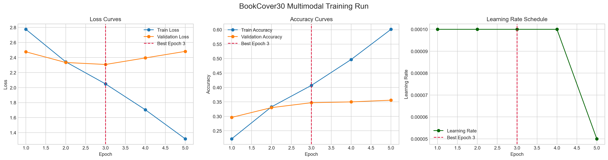
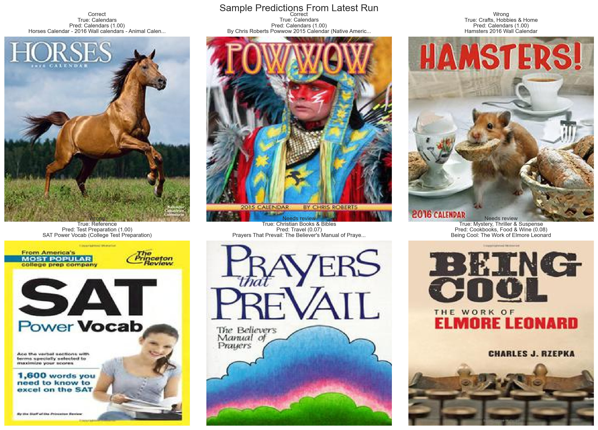

# Multimodal Book Genre Classification and Clustering

This repository started as a notebook prototype for predicting book genres from cover images and titles. It now also includes a modular PyTorch pipeline that is easier to train, evaluate, and extend for digital library workflows where reducing manual cataloging effort matters.

This project now keeps only the Uchida Lab `Task1` data files locally under `data/uchidalab_task1/`. It does not depend on any code from the Uchida Lab repository.

## Why this project matters

Digital libraries and online catalogs often receive incomplete or inconsistent metadata. A practical genre-assignment system should do more than output one label:

- infer genres from the cover when text metadata is weak or missing
- fuse image and text when both are available
- return top-k suggestions instead of a brittle single guess
- flag uncertain books for human review
- produce embeddings that can be reused for clustering, search, and recommendation

That is the direction of the upgraded pipeline in this repo.

## What was in the original notebook

The legacy notebook, [BookGenreClassification.ipynb](./BookGenreClassification.ipynb), builds a TensorFlow/Keras multimodal model with:

- `VGG16` for cover-image features
- `Embedding + LSTM` for title features
- dense fusion for genre prediction
- `KMeans` clustering on learned features

The idea is good, but the implementation has research-prototype limits:

- hard-coded local paths tied to one machine
- notebook-only workflow with no reusable modules
- sampling from `Book32` instead of staying aligned to the canonical `BookCover30` split
- incomplete training logs and a very small recorded evaluation sample
- no confidence gating for production review queues
- no embedding export for downstream catalog indexing

## What is new

The new code under [src/bookgenre](./src/bookgenre) adds a reusable pipeline with:

- manifest loading for `BookCover30` and `Book32` style CSV files
- image-aware datasets with category-folder, flat-folder, or ZIP image lookup
- vocabulary building for title and author text
- a gated multimodal fusion model in PyTorch
- training and validation loops with checkpoint export
- top-k prediction with confidence thresholds and `needs_review` flags
- embedding extraction, clustering, and prototype discovery
- a smoke test that verifies the code path without needing the full dataset

The local manifests copied from Task1 are:

- `data/uchidalab_task1/book30-listing-train.csv`
- `data/uchidalab_task1/book30-listing-test.csv`
- `data/uchidalab_task1/bookcover30-labels-train.txt`
- `data/uchidalab_task1/bookcover30-labels-test.txt`

The centralized notebook entry point is [BookGenrePipeline.ipynb](./BookGenrePipeline.ipynb).

## Latest Results

Latest measured run:

- Dataset: BookCover30 official Task1 split
- Training examples: 51,300
- Validation examples: 5,700
- Model: multimodal `resnet18` image encoder + text encoder
- Device: local NVIDIA RTX 4050 Laptop GPU with mixed precision
- Run behavior: resumed training enabled, early stopping enabled, `ReduceLROnPlateau` enabled

Key metrics from the latest completed run:

- Top-1 validation accuracy: `34.74%`
- Best validation loss checkpoint: epoch `3`
- Completed epochs before stop: `5`
- Requested epochs: `20`
- Stopped early: `True`
- Review-queue rate at confidence threshold `0.55`: `75.28%`
- Auto-accept rate: `24.72%`
- Auto-accept accuracy: `70.33%`

The latest run is saved under `outputs/notebook_runs/bookcover30_longrun/`.

### Training Curves



The run improves quickly in the first few epochs, reaches its best validation-loss checkpoint at epoch 3, then begins to flatten and trigger the early-stopping logic instead of continuing to overfit.

### Sample Predictions



The sample panel mixes confident correct predictions, confident mistakes, and low-confidence books that are correctly routed to review. That is a better fit for a digital-library workflow than forcing every book into a fully automatic decision.

## Suggested digital-library workflow

1. Train on `BookCover30` for supervised genre prediction.
2. Run catalog inference on new or weakly labeled books.
3. Auto-accept high-confidence predictions.
4. Send low-confidence items to a manual review queue.
5. Cluster learned embeddings to discover catalog segments and shelf-like groupings.
6. Reuse the embeddings for recommendation, deduplication, and similarity search.

## Project structure

```text
.
|-- BookGenreClassification.ipynb
|-- BookGenrePipeline.ipynb
|-- docs/
|   `-- project_analysis.md
|-- requirements.txt
|-- scripts/
|   |-- cluster_catalog.py
|   |-- predict_catalog.py
|   |-- smoke_test.py
|   `-- train_multimodal.py
`-- src/
    `-- bookgenre/
        |-- __init__.py
        |-- checkpoints.py
        |-- clustering.py
        |-- data.py
        |-- inference.py
        |-- model.py
        `-- training.py
```

## Quick start

Install dependencies:

```bash
pip install -r requirements.txt
```

Run the smoke test:

```bash
python scripts/smoke_test.py
```

Train on a manifest plus downloaded images:

```bash
python scripts/train_multimodal.py ^
  --train-csv "data\uchidalab_task1\book30-listing-train.csv" ^
  --valid-csv "data\uchidalab_task1\book30-listing-test.csv" ^
  --image-root "..\title30cat\224x224" ^
  --output-dir "outputs\bookcover30" ^
  --device auto ^
  --amp
```

Run confidence-aware inference:

```bash
python scripts/predict_catalog.py ^
  --checkpoint-dir "outputs\bookcover30" ^
  --manifest-csv "data\uchidalab_task1\book30-listing-test.csv" ^
  --image-root "..\title30cat\224x224" ^
  --output-file "outputs\predictions.jsonl"
```

Cluster the learned embeddings:

```bash
python scripts/cluster_catalog.py ^
  --checkpoint-dir "outputs\bookcover30" ^
  --manifest-csv "data\uchidalab_task1\book30-listing-test.csv" ^
  --image-root "..\title30cat\224x224" ^
  --output-file "outputs\clusters.json"
```

If CUDA is available, `--device auto` selects it automatically. On NVIDIA GPUs, `--amp` enables mixed precision to reduce memory usage and speed up training.

The trainer now supports:

- explicit best-model saving with `best_epoch` tracked in `training_summary.json`
- early stopping on validation loss
- `ReduceLROnPlateau` learning-rate scheduling
- resume-from-last-epoch behavior through `training_state.pt` when the training signature has not changed

## Dataset sources

- BookCover30 and Book32 dataset repo: <https://github.com/uchidalab/book-dataset>
- Task1 details: <https://github.com/uchidalab/book-dataset/tree/master/Task1>
- Original paper: <https://arxiv.org/abs/1610.09204>

## Recommended next research steps

- add OCR from book covers so subtitle text on the cover itself becomes a feature
- move from flat genres to hierarchical taxonomy prediction
- add open-set detection so out-of-taxonomy books are rejected safely
- add active learning to prioritize uncertain books for librarian review
- use nearest-neighbor retrieval for "similar books" and duplicate detection
